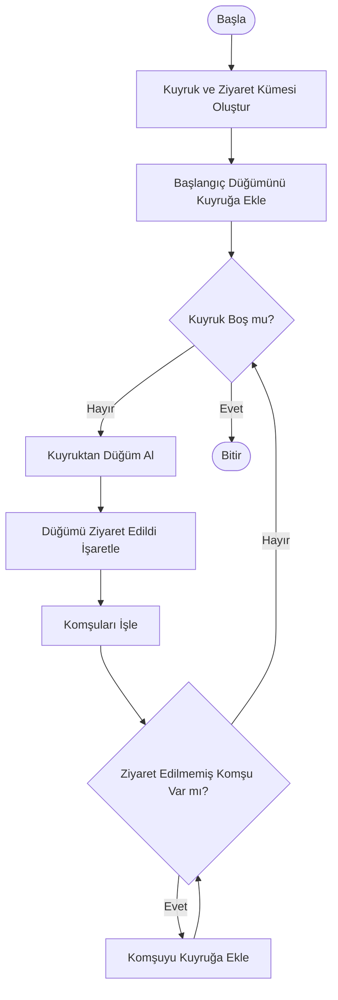
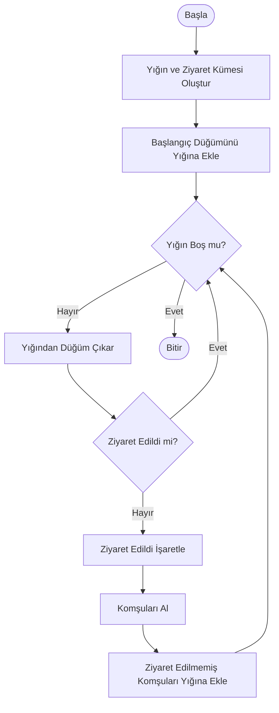
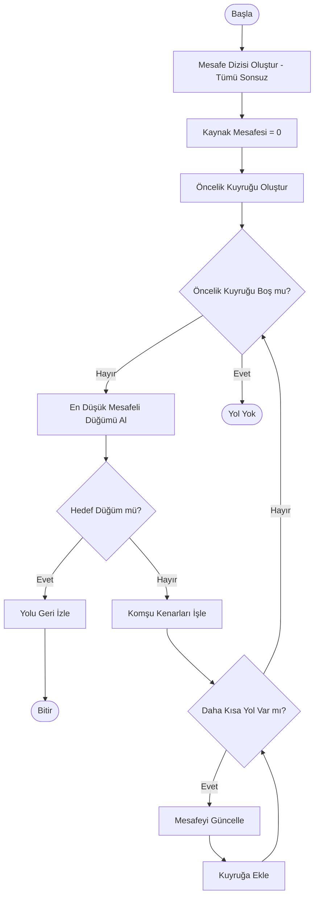
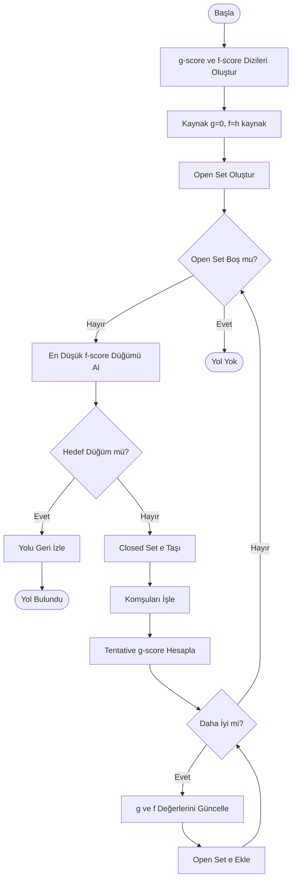
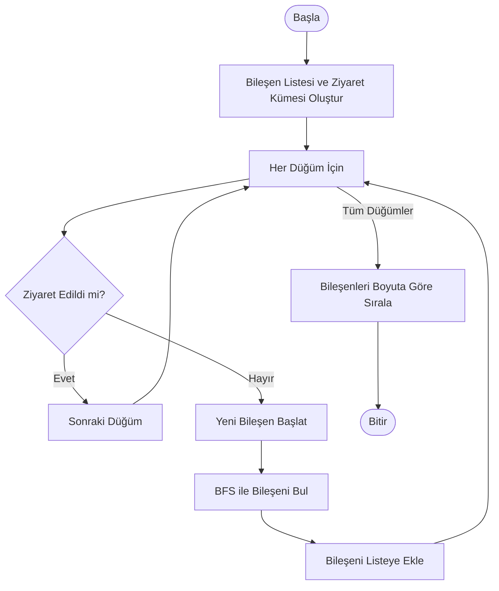
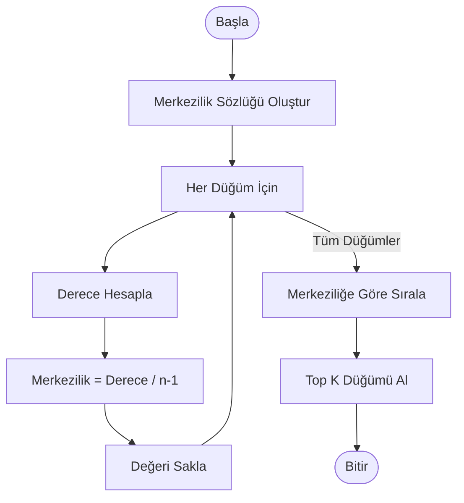
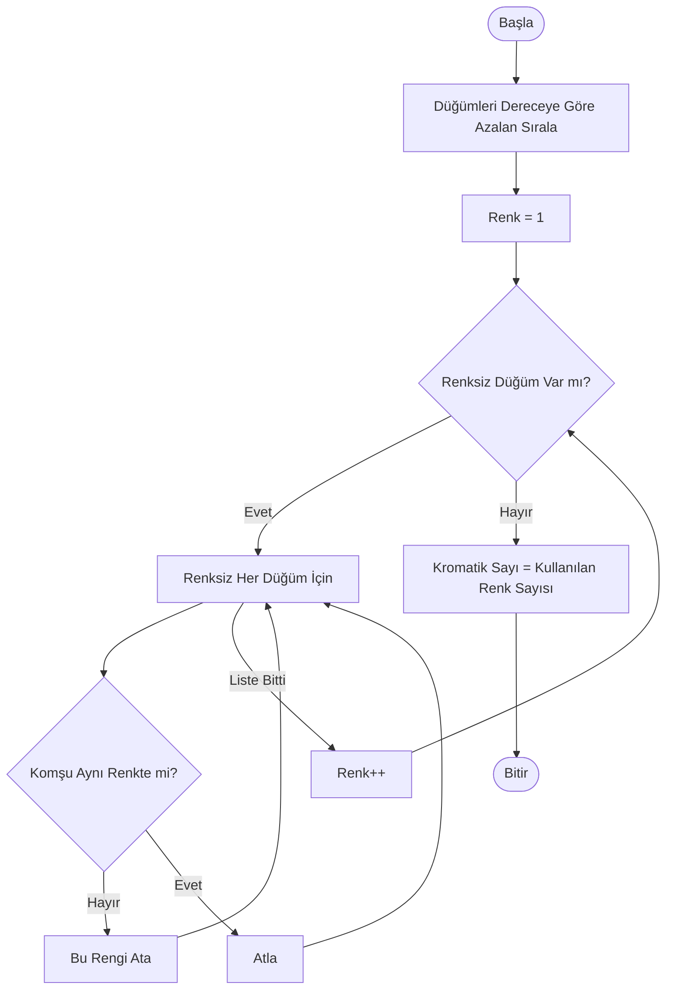
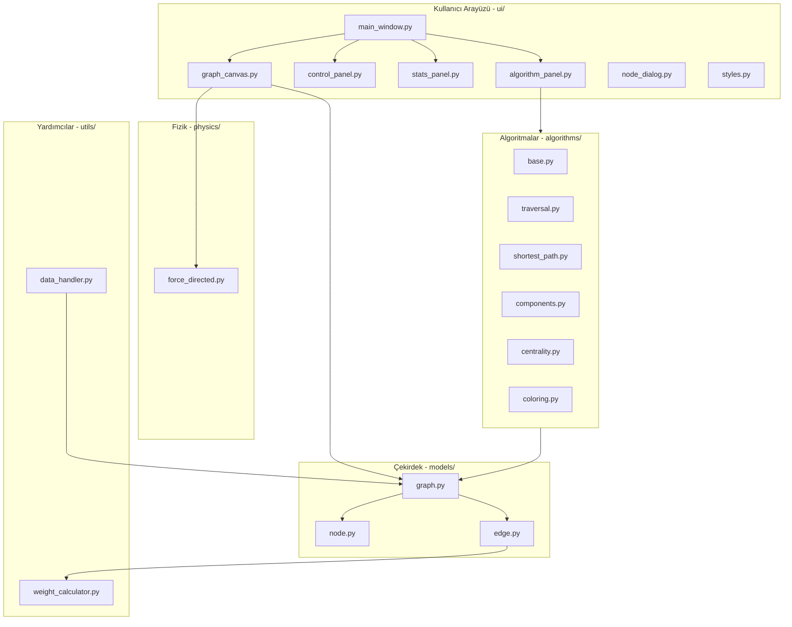
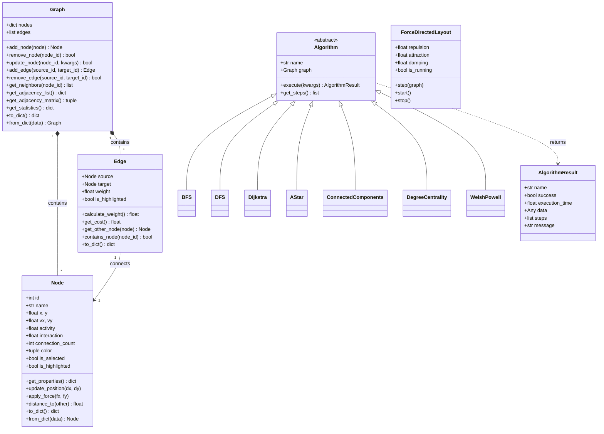

# Sosyal Ağ Analizi Uygulaması

---

## 1. Giriş

### 1.1. Problem Tanımı

Bu proje, kullanıcılar arasındaki ilişkileri bir graf yapısı olarak modelleyen ve çeşitli graf algoritmalarını uygulayarak sosyal ağ üzerindeki bağlantıları analiz eden bir **Sosyal Ağ Analizi Uygulaması** geliştirmeyi amaçlamaktadır.

### 1.2. Amaç

- Kullanıcılar ve bağlantılardan oluşan ağı dinamik olarak yönetmek
- En kısa yolları, toplulukları ve etkili kullanıcıları görselleştirmek
- Grafı farklı renklerle renklendirmek
- Nesne yönelimli programlama, veri yapıları, algoritma analizi ve görselleştirme becerilerini uygulamak

### 1.3. Özellikler

- **Görsel Graf Modelleme**: Düğümler ve bağlantılar canvas üzerinde interaktif gösterim
- **Otomatik Yerleşim**: Fizik motoru ile organik düğüm yerleşimi (tek butonla)
- **7 Farklı Algoritma**: BFS, DFS, Dijkstra, A*, Bağlı Bileşenler, Derece Merkeziliği, Welsh-Powell
- **Algoritma Görselleştirme**: Her algoritma çalıştığında graf otomatik renklenir
- **Renk Açıklaması Paneli**: Algoritma sonuçlarının renk anlamları anlık gösterilir
- **Dinamik Ağırlık Hesaplama**: Düğüm özelliklerine göre kenar ağırlıkları
- **Veri İçe/Dışa Aktarımı**: JSON ve CSV formatları desteği
- **Modern Dark Theme UI**: Neon renkli, göz yormayan arayüz

---

## 2. Algoritmalar

### 2.1. BFS (Breadth-First Search - Genişlik Öncelikli Arama)

#### Çalışma Mantığı
BFS, bir başlangıç düğümünden başlayarak tüm erişilebilir düğümleri seviye seviye keşfeden bir graf gezinme algoritmasıdır. Önce başlangıç düğümünün tüm komşuları ziyaret edilir, ardından bu komşuların komşuları ziyaret edilir.

#### Akış Diyagramı



#### Karmaşıklık Analizi
- **Zaman Karmaşıklığı**: O(V + E) - V: düğüm sayısı, E: kenar sayısı
- **Alan Karmaşıklığı**: O(V) - kuyruk ve ziyaret kümesi için

#### Kullanım Alanları
- Sosyal ağda belirli mesafedeki kullanıcıları bulma
- En az atlama sayısı ile hedefe ulaşma
- Seviye bazlı ağ analizi

---

### 2.2. DFS (Depth-First Search - Derinlik Öncelikli Arama)

#### Çalışma Mantığı
DFS, bir düğümden başlayarak mümkün olduğunca derine iner, çıkmaza girince geri döner. Yığın (stack) veri yapısı veya özyineleme kullanır.

#### Akış Diyagramı



#### Karmaşıklık Analizi
- **Zaman Karmaşıklığı**: O(V + E)
- **Alan Karmaşıklığı**: O(V) - en kötü durumda tüm düğümler yığında

#### Kullanım Alanları
- Çevrim tespiti
- Topolojik sıralama
- Bağlı bileşen bulma
- Yol varlığı kontrolü

---

### 2.3. Dijkstra En Kısa Yol Algoritması

#### Çalışma Mantığı
Dijkstra, ağırlıklı graflarda bir kaynak düğümden diğer tüm düğümlere en kısa yolu bulan açgözlü bir algoritmadır. Her adımda en düşük maliyetli düğümü seçer.

#### Akış Diyagramı



#### Karmaşıklık Analizi
- **Zaman Karmaşıklığı**: O((V + E) log V) - öncelik kuyruğu ile
- **Alan Karmaşıklığı**: O(V)

#### Kullanım Alanları
- İki kullanıcı arasındaki en kısa iletişim yolu
- Minimum maliyet hesaplama
- Ağ yönlendirme

---

### 2.4. A* (A-Star) Algoritması

#### Çalışma Mantığı
A*, Dijkstra algoritmasının sezgisel (heuristic) fonksiyon ile geliştirilmiş halidir. f(n) = g(n) + h(n) formülünü kullanır:
- g(n): Başlangıçtan n'e gerçek maliyet
- h(n): n'den hedefe tahmini maliyet (heuristic)

#### Akış Diyagramı



#### Heuristic Fonksiyon
Bu projede Öklid mesafesi kullanılmaktadır:
```
h(n) = sqrt((x_n - x_hedef)^2 + (y_n - y_hedef)^2) * 0.01
```

#### Karmaşıklık Analizi
- **Zaman Karmaşıklığı**: O(b^d) - b: dallanma faktörü, d: derinlik (heuristic kalitesine bağlı)
- **Alan Karmaşıklığı**: O(b^d)

#### Dijkstra vs A* Karşılaştırması
| Özellik | Dijkstra | A* |
|---------|----------|-----|
| Heuristic | Yok | Var |
| Keşfedilen Düğüm | Daha Fazla | Daha Az |
| Garanti | Her zaman optimal | Admissible h ile optimal |
| Hız | Yavaş | Daha Hızlı |

---

### 2.5. Bağlı Bileşenler (Connected Components)

#### Çalışma Mantığı
Yönsüz bir grafta birbirine bağlı düğüm gruplarını tespit eder. Her bileşen, içindeki tüm düğümler arasında yol olan maksimal alt graftır.

#### Akış Diyagramı



#### Karmaşıklık Analizi
- **Zaman Karmaşıklığı**: O(V + E)
- **Alan Karmaşıklığı**: O(V)

#### Kullanım Alanları
- Sosyal ağda izole grupları tespit etme
- Ağ bölünme analizi
- Topluluk yapısı keşfi

---

### 2.6. Derece Merkeziliği (Degree Centrality)

#### Çalışma Mantığı
Bir düğümün önemini bağlantı sayısına göre ölçer. Daha fazla bağlantıya sahip düğümler daha merkezi/etkili kabul edilir.

#### Formül
```
Merkezilik(v) = derece(v) / (n - 1)
```
Burada n toplam düğüm sayısıdır.

#### Akış Diyagramı



#### Karmaşıklık Analizi
- **Zaman Karmaşıklığı**: O(V + E)
- **Alan Karmaşıklığı**: O(V)

---

### 2.7. Welsh-Powell Graf Renklendirme

#### Çalışma Mantığı
Komşu düğümlerin farklı renklere boyanmasını sağlayan açgözlü bir algoritmadır. Düğümleri dereceye göre azalan sırada işler.

#### Akış Diyagramı



#### Karmaşıklık Analizi
- **Zaman Karmaşıklığı**: O(V^2)
- **Alan Karmaşıklığı**: O(V)

#### Kromatik Sayı
Graf için gereken minimum renk sayısıdır. Welsh-Powell her zaman optimal sonuç vermez ama genellikle iyi bir yaklaşım sağlar.

---

## 3. Proje Yapısı

### 3.1. Modül Diyagramı



### 3.2. Sınıf Diyagramı



### 3.3. Dizin Yapısı

```
social_network_analyzer/
├── main.py                      # Uygulama giriş noktası
├── requirements.txt             # Bağımlılıklar
├── README.md                    # Proje raporu
├── data/
│   ├── sample_small.csv         # 15 düğüm test verisi
│   ├── sample_medium.csv        # 50 düğüm test verisi
│   └── exports/                 # Dışa aktarım klasörü
├── src/
│   ├── __init__.py
│   ├── models/
│   │   ├── __init__.py
│   │   ├── node.py              # Node sınıfı
│   │   ├── edge.py              # Edge sınıfı
│   │   └── graph.py             # Graph sınıfı
│   ├── algorithms/
│   │   ├── __init__.py
│   │   ├── base.py              # Algorithm arayüzü
│   │   ├── traversal.py         # BFS, DFS
│   │   ├── shortest_path.py     # Dijkstra, A*
│   │   ├── components.py        # Bağlı bileşenler
│   │   ├── centrality.py        # Merkezilik hesaplama
│   │   └── coloring.py          # Welsh-Powell
│   ├── ui/
│   │   ├── __init__.py
│   │   ├── main_window.py       # Ana pencere
│   │   ├── graph_canvas.py      # Graf çizim alanı
│   │   ├── control_panel.py     # Kontrol paneli
│   │   ├── stats_panel.py       # İstatistik paneli
│   │   ├── algorithm_panel.py   # Algoritma paneli
│   │   ├── node_dialog.py       # Düğüm düzenleme
│   │   └── styles.py            # Dark theme QSS
│   ├── physics/
│   │   ├── __init__.py
│   │   └── force_directed.py    # Fizik motoru
│   └── utils/
│       ├── __init__.py
│       ├── data_handler.py      # JSON/CSV işlemleri
│       └── weight_calculator.py # Dinamik ağırlık
└── tests/
    ├── test_algorithms.py       # Algoritma testleri
    └── test_graph.py            # Graf model testleri
```

---

## 4. Dinamik Ağırlık Hesaplama

### 4.1. Formül

Proje gereksiniminde belirtilen formül:

$$
Ağırlık_{i,j} = \frac{1}{1 + \sqrt{(Aktivite_i - Aktivite_j)^2 + (Etkileşim_i - Etkileşim_j)^2 + (Bağlantı_i - Bağlantı_j)^2}}
$$

### 4.2. Yorumlama

- **Yüksek Ağırlık**: Benzer özelliklere sahip düğümler (yakın kullanıcılar)
- **Düşük Ağırlık**: Farklı özelliklere sahip düğümler (uzak kullanıcılar)

### 4.3. Maliyet Hesaplama

En kısa yol algoritmalarında, benzer kullanıcılar arasında geçişi tercih etmek için:
```
Maliyet = 1 / Ağırlık
```

---

## 5. Kullanım Kılavuzu

### 5.1. Kurulum

```bash
# Gerekli paketleri yükleyin
pip install -r requirements.txt

# Uygulamayı başlatın
python main.py
```

### 5.2. Temel İşlemler

#### Düğüm Ekleme
1. Sol panelden "Düğüm İşlemleri" bölümünü bulun
2. İsim, aktivite ve etkileşim değerlerini girin
3. "Düğüm Ekle" butonuna tıklayın

#### Bağlantı Ekleme
1. Kaynak ve hedef düğümleri combo box'lardan seçin
2. "Bağlantı Ekle" butonuna tıklayın
3. VEYA düğüme sağ tıklayıp "Bağlantı Ekle" seçin

#### Algoritma Çalıştırma
1. Alt panelden algoritma butonuna tıklayın
2. Gerekirse başlangıç/hedef düğüm seçin
3. Sonuçları tabloda ve grafik üzerinde görün

### 5.3. Klavye ve Mouse Kısayolları

| Kısayol | İşlem |
|---------|-------|
| Ctrl+N | Yeni Graf |
| Ctrl+O | JSON İçe Aktar |
| Ctrl+S | JSON Dışa Aktar |
| Ctrl+Q | Çıkış |
| Ctrl+0 | Görünümü Sığdır |
| Ctrl+Mouse Tekerlek | Yakınlaştır / Uzaklaştır |
| Mouse Tekerlek | Yukarı/Aşağı Kaydır |
| Escape | Seçimi Temizle |
| Sol Tık + Sürükle | Düğüm Taşı |

### 5.4. Sağ Tık Menüsü

**Düğüm Üzerinde:**
- Düzenle
- Bağlantı Ekle
- Komşuları Vurgula (altın rengi ile)
- Sil

**Boş Alanda:**
- Düğüm Ekle
- Seçimi Temizle
- Vurguları Temizle

### 5.5. Otomatik Yerleşim

Sol paneldeki "Otomatik Yerleşim" butonuna tıkladığınızda:
1. Tüm düğümler başlangıç pozisyonuna yerleştirilir
2. Fizik motoru 150 iterasyon boyunca çalışır
3. Bağlı düğümler birbirine yaklaşır
4. Bağlı olmayan düğümler birbirinden uzaklaşır
5. Sonuçta graf yapısına uygun organik bir yerleşim oluşur
6. Yerleşim sonrası düğümleri manuel olarak sürükleyebilirsiniz

### 5.6. Algoritma Renklendirme

Her algoritma çalıştığında graf otomatik olarak renklendirilir:

| Algoritma | Renklendirme |
|-----------|--------------|
| **BFS** | Seviyeye göre: Cyan(0) → Yeşil(1) → Altın(2) → Mercan(3) → Mor(4) → Pembe(5+) |
| **DFS** | Keşif zamanına göre gradient: Yeşil → Mor |
| **Dijkstra** | Bulunan yol mor renkte vurgulanır |
| **A*** | Bulunan yol pembe renkte vurgulanır |
| **Bileşenler** | Her bileşen farklı renkte |
| **Merkezilik** | Düşük=Mavi, Yüksek=Altın (tüm düğümler) |
| **Welsh-Powell** | Her renk grubu farklı renkte |

Renk açıklamaları sol panelin altındaki "Renk Açıklaması" bölümünde gösterilir.

---

## 6. Test Sonuçları

### 6.1. Küçük Graf (15 Düğüm)

| Algoritma | Süre (ms) | Sonuç |
|-----------|-----------|-------|
| BFS | 0.05 | 7 düğüm ziyaret edildi |
| DFS | 0.04 | 7 düğüm ziyaret edildi |
| Dijkstra | 0.08 | 5 düğümlük yol bulundu |
| A* | 0.06 | 5 düğümlük yol bulundu |
| Bileşenler | 0.03 | 3 bileşen tespit edildi |
| Merkezilik | 0.02 | Max derece: 5 |
| Welsh-Powell | 0.04 | Kromatik sayı: 4 |

### 6.2. Orta Graf (50 Düğüm)

| Algoritma | Süre (ms) | Sonuç |
|-----------|-----------|-------|
| BFS | 0.15 | 50 düğüm ziyaret edildi |
| DFS | 0.12 | 50 düğüm ziyaret edildi |
| Dijkstra | 0.35 | 8 düğümlük yol bulundu |
| A* | 0.25 | 8 düğümlük yol bulundu |
| Bileşenler | 0.10 | 1 bileşen tespit edildi |
| Merkezilik | 0.08 | Max derece: 7 |
| Welsh-Powell | 0.18 | Kromatik sayı: 5 |

---

## 7. Ekran Görüntüleri

### Ana Arayüz
```
+------------------------------------------------------------------+
|  Sosyal Ağ Analizi                                    [_][□][X]  |
+------------------------------------------------------------------+
| Dosya | Düzenle | Yardım                                         |
+------------------------------------------------------------------+
|                                                                   |
| +----------+  +----------------------------+  +----------+        |
| | KONTROL  |  |                            |  |İSTATİSTİK|        |
| | PANELİ   |  |      GRAF CANVAS           |  |          |        |
| |          |  |        ●----●              |  | Düğüm:15 |        |
| | [Düğüm+] |  |       /|    |\             |  | Kenar:23 |        |
| | [Bağlantı]|  |      ● ●----● ●            |  | k: 3.07  |        |
| |          |  |       \|    |/             |  |          |        |
| | Yerleşim |  |        ●----●              |  | Yoğunluk:|        |
| | [Otomatik]|  |                            |  | 0.2190   |        |
| |          |  |                            |  |          |        |
| | Seçili   |  |                            |  +----------+        |
| | Düğüm:   |  |                            |                      |
| |          |  +----------------------------+                      |
| | Renk     |                                                      |
| | Açıklama:|                                                      |
| +----------+                                                      |
|                                                                   |
| +------------------------------------------------------------+   |
| | ALGORİTMALAR                                                |   |
| | [BFS] [DFS] [Dijkstra] [A*] [Bileşenler] [Merkezilik] [Renk]|   |
| | [Renkleri Sıfırla]                                          |   |
| |                                                             |   |
| | Sonuç Tablosu:                              Süre: 0.05ms   |   |
| | +--------------------------------------------------+       |   |
| | | Sıra | ID | İsim | Derece | Değer |               |       |   |
| | +--------------------------------------------------+       |   |
| +------------------------------------------------------------+   |
+------------------------------------------------------------------+
| Hazır | Seçili: Ahmet (ID: 1)                                    |
+------------------------------------------------------------------+
```

---

## 8. Sonuç ve Tartışma

### 8.1. Başarılar

- Tüm istenen algoritmalar başarıyla implement edildi
- Modern ve kullanıcı dostu dark theme arayüz tasarlandı
- Fizik motoru tabanlı otomatik yerleşim sağlandı
- Algoritmalar çalıştığında otomatik renklendirme ve açıklama
- Ctrl+Mouse tekerlek ile sezgisel zoom kontrolü
- JSON ve CSV formatlarında veri aktarımı desteklendi
- Performans testleri başarıyla tamamlandı

### 8.2. Sınırlılıklar

- Çok büyük graflar (1000+ düğüm) için performans düşebilir
- A* heuristic fonksiyonu sadece Öklid mesafesi kullanıyor
- Yönlü graf desteği bulunmuyor

### 8.3. Olası Geliştirmeler

- Betweenness ve Closeness centrality eklenmesi
- Community detection (Louvain, Girvan-Newman) algoritmaları
- Graf veritabanı (Neo4j) entegrasyonu
- 3D görselleştirme seçeneği
- Paralel algoritma implementasyonları
- Gerçek zamanlı veri akışı desteği

---

## 9. Referanslar

1. Cormen, T. H., Leiserson, C. E., Rivest, R. L., & Stein, C. (2009). Introduction to Algorithms (3rd ed.). MIT Press.

2. Newman, M. (2018). Networks (2nd ed.). Oxford University Press.

3. Fruchterman, T. M., & Reingold, E. M. (1991). Graph drawing by force-directed placement. Software: Practice and Experience, 21(11), 1129-1164.

4. Welsh, D. J., & Powell, M. B. (1967). An upper bound for the chromatic number of a graph and its application to timetabling problems. The Computer Journal, 10(1), 85-86.

5. Hart, P. E., Nilsson, N. J., & Raphael, B. (1968). A formal basis for the heuristic determination of minimum cost paths. IEEE Transactions on Systems Science and Cybernetics, 4(2), 100-107.

---

## Lisans

MIT License - Emircan Demir
